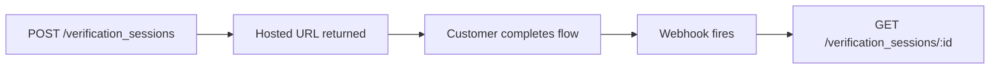

# Identity API

The Identity API runs the full verification stack — document review, selfie liveness, bank account verification, and business KYB. The full reference lives at [Reference](reference/README.md), auto-generated from the OpenAPI spec.

## Resources

<table data-view="cards"><thead><tr><th></th><th></th><th></th><th data-hidden data-card-target data-type="content-ref"></th></tr></thead><tbody><tr><td><h3><i class="fa-id-card" style="color:$primary;">:id-card:</i></h3></td><td><strong>Verification sessions</strong></td><td>Top-level resource — one per identity, bank, or business verification.</td><td><a href="reference/README.md">reference/README.md</a></td></tr><tr><td><h3><i class="fa-file-magnifying-glass" style="color:$primary;">:file-magnifying-glass:</i></h3></td><td><strong>Documents</strong></td><td>Captured documents and their per-check results.</td><td><a href="reference/README.md">reference/README.md</a></td></tr><tr><td><h3><i class="fa-building-columns" style="color:$primary;">:building-columns:</i></h3></td><td><strong>Bank verifications</strong></td><td>Plaid-instant or micro-deposits flow records.</td><td><a href="reference/README.md">reference/README.md</a></td></tr></tbody></table>

## How a verification flows



1. **Your server creates a session** — pass `type` (identity/bank/business) and `customer`. Get back a session record with a `url` to send the customer to.
2. **Customer completes the hosted flow** — Evolve handles all the capture and review.
3. **Webhook fires when complete** — `verification_session.verified`, `.failed`, or `.manual_review`. See [Event catalog](../webhooks/event-catalog.md).
4. **You retrieve the result** — `GET /verification_sessions/:id` returns the full check breakdown.

You can also drive the flow programmatically — submit documents, run individual checks, override decisions. See the [Reference](reference/README.md) for those endpoints.

## A minimal example



```js
const session = await evolve.identity.verificationSessions.create({
  type: "identity",
  customer: "cus_4n2P3qR5sT6uV",
  return_url: "https://yourapp.com/verified",
});

// Send `session.url` to the customer.
console.log(session.url);
```



```python
session = evolve.VerificationSession.create(
    type="identity",
    customer="cus_4n2P3qR5sT6uV",
    return_url="https://yourapp.com/verified",
)
print(session.url)
```



```bash
curl https://api.evolve.com/v2/verification_sessions \
  -H "Authorization: Bearer $EVOLVE_SECRET_KEY" \
  -d type=identity \
  -d customer=cus_4n2P3qR5sT6uV \
  -d return_url=https://yourapp.com/verified
```



## Conceptual background

For the product-side concepts — when to verify, which method to pick, what the customer sees — see the [Identity product space](../../../products/identity/README.md).

## Try it

<p><a href="reference/README.md" class="button primary">Open the reference</a></p>
