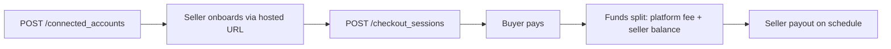

# Overview

The Connect API extends Payments with the platform-specific resources — connected accounts (sellers), transfers (moving funds to sellers), and checkout sessions (taking payments on a seller's behalf). The full reference lives at [Reference](reference.md).

## Resources

<table data-view="cards"><thead><tr><th></th><th></th><th></th><th data-hidden data-card-target data-type="content-ref"></th></tr></thead><tbody><tr><td><h4><i class="fa-store" style="color:$primary;">:store:</i></h4></td><td><strong>Connected accounts</strong></td><td>The sellers on your platform. One per seller.</td><td><a href="reference.md#connected-accounts">#connected-accounts</a></td></tr><tr><td><h4><i class="fa-money-bill-transfer" style="color:$primary;">:money-bill-transfer:</i></h4></td><td><strong>Transfers</strong></td><td>Move funds from platform balance to a connected account.</td><td><a href="reference.md#transfers">#transfers</a></td></tr><tr><td><h4><i class="fa-window-maximize" style="color:$primary;">:window-maximize:</i></h4></td><td><strong>Checkout sessions</strong></td><td>Hosted or embedded checkout for a Connect payment.</td><td><a href="reference.md#checkout-sessions">#checkout-sessions</a></td></tr></tbody></table>

## A minimal flow



## Application fees

Every checkout session can carry an `application_fee_amount` — your platform's cut, in the smallest currency unit:

```http
POST /v2/checkout_sessions
{
  "amount": 10000,
  "currency": "usd",
  "connected_account": "acct_3KsM12pL9q",
  "application_fee_amount": 200
}
```

That charges the buyer $100, transfers $98 to the seller's connected account, and credits $2 to your platform balance. By default the card processing fee is netted from your application fee — see [Connect → Splitting payments](../../../products/connect/platform-setup/splitting-payments.md) for the full mechanics including pass-through fees.

## Direct charges vs destination charges

Two patterns for routing a payment to a seller:

| Pattern                | When to use                                                                                                                                                                                                               |
| ---------------------- | ------------------------------------------------------------------------------------------------------------------------------------------------------------------------------------------------------------------------- |
| **Direct charge**      | The seller is the merchant of record. Set `Evolve-Account: acct_*` header on the charge. The seller's statement descriptor appears on the buyer's card statement.                                                         |
| **Destination charge** | The platform is the merchant of record. Charge happens on the platform; a transfer moves the funds to the connected account. The platform's descriptor appears on the buyer's statement. Most Connect platforms use this. |

Choose at the platform level by setting your default in **Connect → Settings → Charge type** in the dashboard. Override per checkout session if needed.

## Conceptual background

For the product-side concepts — onboarding flow, payout scheduling, dispute routing, refund splits — see the [Connect product space](../../../products/connect/).

## Try it

<a href="reference.md" class="button primary">Open the reference</a>
