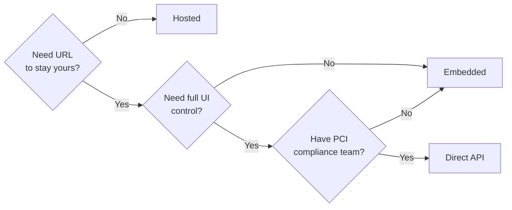

# Hosted vs embedded

There are three ways to put a Connect checkout in front of buyers. They share the same backend (same fees, same payouts, same dispute flow) — the differences are in how much engineering you take on and how much control you keep over the buyer's experience.

## The three shapes


{% column width="33%" %}

### <i class="fa-link" style="color:$primary;">:link:</i> Hosted

A URL you redirect the buyer to. Evolve hosts the page; you don't render anything.

* **Setup time:** under an hour.
* **PCI scope:** zero.
* **Customization:** logo, colors, language.
* **URL:** `checkout.evolve.com/c/...`



{% column width="33%" %}

### <i class="fa-window-maximize" style="color:$primary;">:window-maximize:</i> Embedded

Evolve's checkout rendered inside a div on your site, with your URL.

* **Setup time:** a day.
* **PCI scope:** SAQ A.
* **Customization:** layout, fields, full theme control.
* **URL:** stays yours.



{% column width="33%" %}

### <i class="fa-code" style="color:$primary;">:code:</i> Direct API

Build the checkout from scratch. You handle the card collection.

* **Setup time:** weeks.
* **PCI scope:** SAQ D (highest).
* **Customization:** total.
* **URL:** stays yours.




## Which to pick

A short decision tree:



In our experience, the right starting choice for most platforms:

| You are... | Start with |
| --- | --- |
| A new platform under 6 months old | Hosted |
| An established platform under $10M GMV | Hosted or embedded |
| An established platform $10M+ GMV with brand standards | Embedded |
| A regulated platform that needs total control | Direct API |

You can migrate from hosted to embedded later without changing your seller onboarding or payout setup — they're independent layers.

## Hosted in detail

Hosted is what you get on the [Connect Quickstart](../quickstart/onboard-your-first-seller.md) by default. The flow:




### Your server creates a checkout session

You call `POST /v1/checkout_sessions` with the seller's connected account, the amount, the application fee, and a `success_url` and `cancel_url` to redirect to.





### You redirect the buyer

The response gives you a URL like `https://checkout.evolve.com/c/cs_3KsM12pL9q`. Redirect the buyer there.





### Evolve hosts the rest

The buyer sees the checkout, pays, and is redirected to your `success_url` (or `cancel_url`). The session ID is appended so your server can confirm what happened.




This is the lowest-PCI-scope, lowest-engineering option. It's also the option most platforms launch with and stay on.

## Embedded in detail

Embedded gives you the same backend but renders the checkout inside your own page, using a JavaScript SDK and an iframe. The card collection still happens in an Evolve-hosted iframe (so your PCI scope stays SAQ A), but the surrounding chrome is yours.

```html
<div id="evolve-checkout"></div>
<script src="https://js.evolve.com/v1/connect.js"></script>
<script>
  const evolve = Evolve('pk_test_...');
  evolve.mountCheckout('#evolve-checkout', {
    sessionId: 'cs_3KsM12pL9q',
  });
</script>
```

The session is created server-side the same way as for hosted, but instead of redirecting, you mount it on your page.

## Direct API in detail

Direct API integrations build the entire checkout from scratch — your form, your field validation, your payment-method selection. The card details still pass through a JavaScript Element so they don't touch your servers, but everything around them is yours.

This is the right choice for:

* Mobile apps (where you'd render checkout inside the app).
* Highly customized B2B onboarding flows.
* Platforms with PCI compliance teams who want every pixel under their control.

Most platforms don't need this level of control and pay for it in engineering time. See [Developers / Connect API](../../../developers/connect-api/README.md) for the API reference.

## Per-seller variation

Different sellers may want different checkout shapes. A high-volume marketplace seller might want their own subdomain and embedded flow; a long-tail seller might be fine with hosted. Connect supports both — you can configure the default at the platform level and override per-seller in the connected account record.

The override is just a setting; the buyer doesn't know which shape any given seller is using.

## Related

* [Buyer experience](buyer-experience.md) — what the buyer sees regardless of shape.
* [Customization](customization.md) — themes, languages, fields.
* [Splitting payments](../platform-setup/splitting-payments.md) — application fees configured at session creation.
