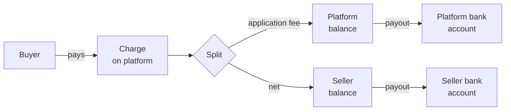

# Platform setup

This section covers everything that happens on the platform side of Connect — separate from the buyer-facing [embedded checkout](../embedded-checkout/README.md). These are the configurations and workflows that run *behind* the buyer experience: how sellers join your platform, how each payment is split, how sellers get paid out, and how you handle the messy moments (refunds, disputes, terminations).

Most of this is configured once at platform launch and tweaked occasionally as your business scales. The exception is the daily operational work — issuing refunds, responding to disputes, onboarding new sellers — which lives in the same dashboards your team uses every day.

## The four jobs

<table data-view="cards"><thead><tr><th></th><th></th><th></th><th data-hidden data-card-target data-type="content-ref"></th></tr></thead><tbody><tr><td><h3><i class="fa-user-plus" style="color:$primary;">:user-plus:</i></h3></td><td><strong>Onboarding sellers</strong></td><td>Get a seller from "signed up" to "ready to take payments."</td><td><a href="onboarding-sellers.md">onboarding-sellers.md</a></td></tr><tr><td><h3><i class="fa-percent" style="color:$primary;">:percent:</i></h3></td><td><strong>Splitting payments</strong></td><td>Application fees, flat fees, conditional rules.</td><td><a href="splitting-payments.md">splitting-payments.md</a></td></tr><tr><td><h3><i class="fa-money-bill-transfer" style="color:$primary;">:money-bill-transfer:</i></h3></td><td><strong>Payouts to sellers</strong></td><td>Schedules, bank routing, holds.</td><td><a href="payouts.md">payouts.md</a></td></tr><tr><td><h3><i class="fa-rotate-left" style="color:$primary;">:rotate-left:</i></h3></td><td><strong>Refunds and disputes</strong></td><td>Who issues, who pays, who responds.</td><td><a href="refunds-and-disputes.md">refunds-and-disputes.md</a></td></tr></tbody></table>

## How the money flows

Each charge produces three financial movements on Evolve's side:

1. **Authorization and capture** of the buyer's card — handled by [Payments](../../payments/concepts/payment-lifecycle.md).
2. **Application fee** to the platform's Evolve balance.
3. **Transfer** of the net amount to the seller's connected-account balance.

Both balances pay out independently on their own schedules. The platform's balance settles like any single-merchant Payments balance; each seller's balance settles to their own bank account on the schedule you set for them.

## Roles on your team

Connect introduces a few platform-specific roles you may want to set up:

| Role | What they do |
| --- | --- |
| **Seller success** | Helps new sellers complete onboarding, troubleshoots verification failures. |
| **Operations** | Issues refunds the seller can't or won't, escalates disputes, manages risk holds. |
| **Compliance** | Reviews flagged sellers, manages seller terminations, runs periodic re-KYC. |
| **Finance** | Reconciles the platform's settlement, handles platform-level reporting. |

You can configure granular dashboard permissions per role in **Settings → Team → Roles**. Most platforms give Seller Success access to seller details and onboarding flow, but not to platform-level financial data.

## Platform reporting

Two new report types appear in **Reports** when Connect is enabled:

* **Per-seller report** — every charge, refund, fee, and payout for a specific seller. Useful for support and per-seller close-out.
* **Application fees report** — total fees earned across all sellers, by day, by seller cohort, by transaction shape. This is your platform's revenue line.

Both reports are exportable via [scheduled exports](../../payments/reporting/sharing-exports.md), the same way Payments reports are.

## Plan considerations




**You're on Growth** — up to 100 connected accounts. The full Connect feature set is available, with the volume cap as the only differentiator from Enterprise.







**You're on Enterprise** — unlimited accounts, plus white-label embedded checkout, custom onboarding workflows, and consolidated KYC across all sellers. Talk to your account team for the platform-launch playbook.




## Related

* [Connect overview](../README.md) — high-level on what Connect is.
* [Payments](../../payments/README.md) — Connect inherits everything from Payments.
* [Identity verification](../../identity/verification-flows/README.md) — used for seller onboarding.
