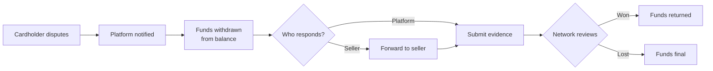

# Refunds and disputes

When a payment reverses — the buyer asks for their money back, or the cardholder disputes the charge — the question on a Connect platform is: **who pays?** The buyer always gets their money back; the question is whether the seller's balance covers it, the platform's balance does, or some combination.

Most platforms have a default policy and override it case-by-case. This page covers what's possible and how to configure it.

## Refunds

Refunds on Connect work like [Payments refunds](../../payments/reconciliation/refunds.md), with one extra decision: how the refund is split between the platform and the seller.

### The default split

By default, a refund mirrors the original payment's split — proportionally:

```
Original payment: $100, with a $5 application fee.
Full refund:      -$100, with -$5 from the platform balance and -$95 from the seller balance.
```

For partial refunds, the platform fee is reduced proportionally:

```
Original payment: $100, with a $5 application fee.
$25 refund:       -$25, with -$1.25 from the platform and -$23.75 from the seller.
```

This is the "fair" default — both parties give back proportional amounts.

### Override: keep the application fee

Sometimes the platform shouldn't bear refund cost — for example, if the seller is responsible for the issue (defective product, late shipment) and the seller-side terms say so. Set `refund_application_fee: false`:

```
Original payment: $100, with a $5 application fee.
Full refund:      -$100, all from the seller balance ($95) plus the seller absorbs the $5 fee.
```

The seller's balance goes down by the full $100. The platform's application fee stays.

### Override: platform covers everything

The reverse — platform absorbs the full refund cost. Useful for goodwill refunds the platform issues at its own discretion. The platform's balance goes down by $100 and the seller is not affected.

This is technically two separate operations: a refund (platform-funded) and no transfer reversal. The platform pays out $100 from its balance directly to the buyer's card.

### Who can issue refunds

By default, both the platform and the seller can issue refunds against any payment. You can restrict this:

* **Platform-only refunds** — sellers can't issue refunds; they must request the platform to do it. Common for marketplaces where the platform handles all customer service.
* **Seller-only refunds** — sellers handle their own refunds; platform stays out of the loop. Common for B2B platforms where the seller has a direct relationship with the buyer.
* **Either** (default) — both can issue. The first one to act takes the action.

Configure in **Connect → Settings → Refund permissions**.

## Disputes

Disputes are more complicated than refunds because the timeline is longer (20+ days for evidence submission, 30–75 days for the decision) and the cost includes both the disputed amount and a $15 dispute fee.

### Who's the merchant of record

On Connect, the **platform is the merchant of record** for card-network purposes. This means:

* Disputes are filed against the platform's merchant ID.
* The platform's [dispute rate](../../payments/reconciliation/disputes.md) is what the network monitors.
* Platform-level dispute thresholds (1.0% under most network rules) apply across all sellers' charges combined.

A bad seller can drag down the platform's overall dispute rate, which is why most platforms care about dispute handling and seller risk management.

### Who pays

Three policies for who absorbs the disputed amount and fee:

<table data-view="cards"><thead><tr><th></th><th></th><th></th><th data-hidden data-card-target data-type="content-ref"></th></tr></thead><tbody><tr><td><h3><i class="fa-store" style="color:$primary;">:store:</i></h3></td><td><strong>Pass to seller</strong></td><td>Seller's balance covers the disputed amount + fee. Most common.</td><td></td></tr><tr><td><h3><i class="fa-circles-overlap" style="color:$primary;">:circles-overlap:</i></h3></td><td><strong>Platform absorbs</strong></td><td>Platform balance covers everything. Used for premium-tier sellers.</td><td></td></tr><tr><td><h3><i class="fa-scale-balanced" style="color:$primary;">:scale-balanced:</i></h3></td><td><strong>Split</strong></td><td>Platform takes the fee, seller takes the disputed amount. The "fair" default.</td><td></td></tr></tbody></table>

You can set the policy at the platform default and override per-seller.

### Who responds

The platform always *can* respond to a dispute (since the dispute is technically against the platform). The question is whether you want to.

Two patterns:

**Platform handles all disputes.** The platform's ops team owns the dispute queue. They gather evidence (often by asking the seller for it), submit, and accept the outcome. Common for platforms that already handle customer support centrally.

**Delegate to seller.** The platform forwards the dispute to the seller via email and the seller's portal. The seller has X days (you choose; we recommend 7) to submit evidence; if they don't respond, the platform either accepts the dispute or submits empty evidence. Common for marketplaces where the seller has the actual product and shipping records.

### Dispute timeline



The total clock — dispute opens to outcome — is typically 30–75 days. During that time, the disputed funds are withheld from the responsible balance (per the policy above).

## Best practices

Three things that consistently reduce dispute costs on Connect platforms:

<details>

<summary>Make refunds easy for buyers</summary>

A buyer who can't get a refund through your platform will go to their bank instead. A bank chargeback costs $15 in fees and damages your dispute rate; a platform refund costs $0 in fees and doesn't.

Surface a "Get a refund" link on the receipt and on the seller's storefront. Make the seller's policy clear at checkout.

</details>

<details>

<summary>Keep an eye on per-seller dispute rates</summary>

A small number of bad-actor sellers can drag down the whole platform's dispute rate. The per-seller dispute report shows you who's costing you. Set a threshold — typically 1% — above which sellers are paused for review.

</details>

<details>

<summary>Set evidence-submission expectations with sellers at onboarding</summary>

Sellers who haven't been told they're on the hook for disputes don't gather evidence well. The onboarding emails include a brief "what happens if a buyer disputes" doc; surface it again in your seller-facing portal so it's findable when they need it.

</details>

## Related

* [Splitting payments](splitting-payments.md) — how the original split affects the refund split.
* [Payouts to sellers](payouts.md) — how disputes and refunds delay payouts.
* [Disputes (Payments)](../../payments/reconciliation/disputes.md) — the underlying dispute mechanics.
