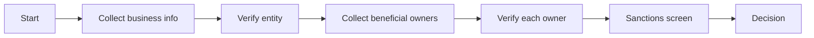

# Business verification (KYB)

Business verification — KYB, "know your business" — confirms three things about a business you're onboarding: that the entity actually exists, that it's not on a sanctions or blocklist, and that the people you're dealing with are who they say they are (the **beneficial owners**).

You'll need it if you run a marketplace and onboard sellers, you operate a B2B platform that pays out to vendors, you sell to other businesses on credit, or any time you process payments on behalf of a third party.




**Business verification is an Enterprise feature.** It requires the data partnerships and compliance review processes only available on the Enterprise plan. [Talk to your account team](mailto:support@evolve.com) if you're considering it.




## What's checked

A KYB verification is a bundle of separate checks, run together against the business and its owners:

<table data-view="cards"><thead><tr><th></th><th></th><th></th><th data-hidden data-card-target data-type="content-ref"></th></tr></thead><tbody><tr><td><h3><i class="fa-people-roof" style="color:$primary;">:people-roof:</i></h3></td><td><strong>Beneficial ownership</strong></td><td>Who owns ≥25% of the business — and verify each one.</td><td><a href="beneficial-ownership.md">beneficial-ownership.md</a></td></tr><tr><td><h3><i class="fa-ban" style="color:$primary;">:ban:</i></h3></td><td><strong>Sanctions screening</strong></td><td>Check the business and owners against sanctions lists.</td><td><a href="sanctions-screening.md">sanctions-screening.md</a></td></tr></tbody></table>

Plus, on every KYB:

* **Entity existence** — the business is registered with the state/country it claims, in good standing.
* **Tax ID match** — the EIN (or local equivalent) matches the registered name.
* **Address verification** — the business address resolves to a real location, not a virtual office.

## A typical KYB session

The whole flow takes 2–10 business days, depending on:

* The country of registration (US is fastest; some jurisdictions require manual record pulls).
* Whether all owners can be verified online or some require manual document review.
* Whether anything flags during sanctions screening.

For most US LLCs and corporations, KYB completes within 2 business days.

## Hosted vs. API-driven

Two integration shapes:

* **Hosted KYB form** — a single Evolve-hosted URL the business owner fills in. Best when the customer is human-in-the-loop. Most marketplaces use this.
* **API-driven** — your code submits the business info and triggers each check separately. Best when you've already collected everything in your own onboarding flow.

For the hosted flow, the URL is generated from **Identity → Business verifications → New** in the dashboard or via a single API call. For the API-driven path, see [Developers / Identity API → Business verifications](../../../../developers/identity-api/business.md).

## Decisions

| Outcome | What it means |
| --- | --- |
| **Verified** | Entity, owners, and sanctions checks all clean. You can onboard. |
| **Failed** | One or more checks failed. The reason is on the timeline. |
| **Manual review** | Edge cases that Evolve's automated checks couldn't decide — typically owners with names that match (but probably aren't) sanctioned individuals. |

Manual review on KYB takes longer than on individual identity — typically 1–3 business days, since it often requires pulling additional records.

## Ongoing monitoring

KYB isn't a one-shot check. Sanctions lists update daily; ownership changes; businesses dissolve. Evolve runs **ongoing monitoring** against verified businesses — re-screening sanctions weekly and alerting you (via webhook and dashboard) when anything changes.

Ongoing monitoring is included with every KYB at no extra fee, for as long as the business is active in your account.

## Related

* [Beneficial ownership](beneficial-ownership.md) — collecting and verifying the owners.
* [Sanctions screening](sanctions-screening.md) — what lists Evolve checks against.
* [Audit logs](../../compliance/audit-logs.md) — every KYB action is logged.
* [Regional requirements](../../compliance/regional-requirements.md) — country-by-country obligations.
