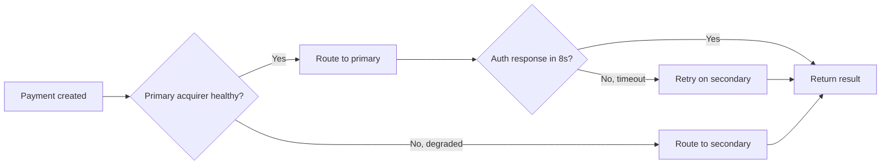

# Failover and retries

Card-acquiring infrastructure is reliable, but it isn't perfect. Once or twice a year, a major acquirer or network has a partial outage — sometimes for an hour, occasionally for most of a day. Failover gives Evolve permission to route around an outage automatically, so your customers keep paying through it.




**Failover is an Enterprise feature.** It requires multiple active acquirer agreements, which most non-Enterprise customers don't maintain. If you're considering it, [talk to your account team](mailto:{{ space.vars.support_email }}).




## How it works

Failover sits on top of [smart routing](smart-routing.md). Where smart routing optimizes for the best route per payment, failover reacts when a route — or a whole network — starts misbehaving.

Two signals trigger failover:

* **Acquirer health** — Evolve continuously monitors each acquirer's success rate, latency, and error mix. When a metric crosses a threshold for more than 60 seconds, that acquirer is temporarily marked degraded and traffic shifts to a backup.
* **Per-payment timeout** — if a single authorization request hasn't responded in 8 seconds, Evolve retries against the secondary acquirer in parallel and returns whichever responds first.

## What you configure

Failover is configured per acquirer pair in **Settings → Routing → Failover**. For each region, you set:

* **Primary acquirer** — the default route.
* **Secondary acquirer** — used during outages or timeouts.
* **Tertiary acquirer** *(optional)* — used if both primary and secondary are degraded.
* **Auto-recovery threshold** — how good the primary's success rate has to be before traffic comes back.

Most Enterprise customers have one or two pairs configured (US-domestic and EU-domestic) and let Evolve manage the rest from defaults.

## Limits

Failover only works between acquirers you have agreements with. If you're single-acquirer in a region, there's nothing to fail over to — you'll see the outage as your customers do. Adding a second acquirer takes a few weeks of paperwork; your account team can start the process if you don't have one yet.

It also doesn't apply to:

* **ACH, SEPA, BACS** — bank rails are single-path by design.
* **3-D Secure challenges** — the issuer's authentication server is the only path; we can't fail over.
* **Disputes and refunds** — these route to the original acquirer of the underlying payment.

## During an outage

When failover activates, two things happen:

1. **A banner appears in the dashboard** listing the affected acquirer and the time it was first marked degraded.
2. **Webhook events `routing.acquirer_degraded` and `routing.acquirer_recovered`** fire if you've subscribed to them — useful if you want to surface the status in your own ops tooling.

You don't need to do anything during an outage — the system manages itself. After it's over, the **Routing report** shows the failover events alongside the rest of the day's payments.

## Testing it

You can simulate a failover from **Settings → Routing → Test failover** in test mode. The simulator marks a fake acquirer degraded and runs a test payment through the secondary, so you can see what the timeline looks like without waiting for a real incident.

## Related

* [Smart routing](smart-routing.md) — picking the best route in normal conditions.
* [Routing report](../reporting/standard-reports.md#routing-report) — seeing failover activity over time.
* [Status page]({{ space.vars.status_page }}) — Evolve's own platform availability.
