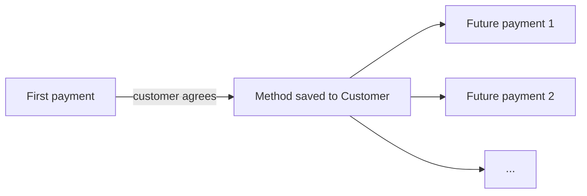

# Saved payment methods

Once a customer has paid you once, you can save their card or bank account and charge it again without asking for the details — for renewals, repeat purchases, or saving them an entry on their next visit.

## When to save a method

A saved method makes sense when:

* You bill on a recurring schedule (subscriptions, memberships).
* You expect repeat purchases (marketplaces, food delivery, B2B re-orders).
* You want to offer one-tap checkout on a future visit.

It does **not** make sense — and may not be allowed — to save a card "just in case." Card-network rules require the customer to explicitly agree to a future charge at the time of the first payment, and to know the rough cadence (monthly, on-demand, per-trip).

## How it works

Saved methods are attached to a **Customer** record. When you create a payment for that customer with a saved method, Evolve uses the stored token — neither you nor the customer ever handles the card number.

## Setting it up




### Capture consent

On your first checkout, show the customer a checkbox or clear text — "Save this card for future purchases" — that they must opt into. The wording is yours; the consent is required.





### Save the method

In hosted Checkout and Elements, this is a `setup_future_usage` toggle on the session. Once the payment succeeds, the method is attached to the customer.

In **Payments → Customers**, you'll see the saved method on the customer's profile — including the brand, last 4, expiry, and which currency it can be used for.





### Charge it later

From the dashboard, open the customer and click **New payment** — the saved method is preselected. From your code, reference the method by id when creating the next payment.




## Mandates and recurring rules

For ACH, SEPA, and BACS, "saving" the method also means recording a **mandate** — the customer's authorization to debit them on a stated cadence. Evolve handles mandate text and signature capture on its hosted UIs. If you build your own UI, you must collect the mandate yourself; see the [Direct debit guide](../../../guides/tutorials/direct-debit-mandates.md).

Cards don't require a formal mandate, but the network distinguishes between four types of subsequent charge:

| Type | Example |
| --- | --- |
| **Customer-initiated** | The customer clicks "Re-order" on your site. |
| **Merchant-initiated, scheduled** | A monthly subscription renewal. |
| **Merchant-initiated, unscheduled** | An e-commerce store charging a stored card after restock. |
| **Customer-not-present, account top-up** | A wallet that auto-tops up when the balance falls below a threshold. |

You set the type when you create the payment. The right value matters for approval rates and dispute outcomes — see the [recurring payments guide](../../../guides/tutorials/recurring-payments.md) for a deeper walkthrough.

## Updating a card before it expires

Cards expire. To reduce involuntary churn, Evolve participates in **account updater** services from Visa, Mastercard, and Amex. When a customer's bank reissues their card, the updated details are pulled in automatically — usually a week or two before the old expiry. You'll see the new expiry on the customer's saved method without any action on your part.

Account updater is on by default on Growth and Enterprise. On Starter you can enable it from **Settings → Cards → Account updater**.

## Removing a saved method

Customers can remove their own saved methods from the receipt email or from your customer portal (if you've built one). You can also remove a method from the dashboard — useful when a customer asks support to forget them.

Removing a method does not affect past payments — it only stops future charges from succeeding against that token.
