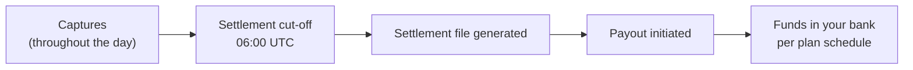

# Reconciliation

Reconciliation is the daily work of matching what's in your bank account against what should be there — payment by payment, fee by fee. Evolve's job is to make that work mechanical: every cent is accounted for, every line item is traceable to its origin, and the file you import into your accounting system always balances.

## What gets reconciled

Three things end up in your settlement, and all three need to balance:

<table data-view="cards"><thead><tr><th></th><th></th><th></th><th data-hidden data-card-target data-type="content-ref"></th></tr></thead><tbody><tr><td><h3><i class="fa-file-csv" style="color:$primary;">:file-csv:</i></h3></td><td><strong>Settlement files</strong></td><td>Daily CSV of every captured payment, fee, and adjustment.</td><td><a href="settlement-files.md">settlement-files.md</a></td></tr><tr><td><h3><i class="fa-rotate-left" style="color:$primary;">:rotate-left:</i></h3></td><td><strong>Refunds</strong></td><td>How refunds appear and reduce your payout.</td><td><a href="refunds.md">refunds.md</a></td></tr><tr><td><h3><i class="fa-gavel" style="color:$primary;">:gavel:</i></h3></td><td><strong>Disputes and chargebacks</strong></td><td>Withheld funds, evidence, and outcomes.</td><td><a href="disputes.md">disputes.md</a></td></tr></tbody></table>

## The daily rhythm

Every day at <code class="expression">space.vars.settlement_time_utc</code>, Evolve closes the books on the previous business day and produces:

* A **settlement file** (CSV) listing every payment, refund, fee, and adjustment that contributed to that day's balance.
* A **payout** to your linked bank account, equal to the net amount on the file.
* A **balance update** in the dashboard reflecting the new available balance.

Your finance team's job each day is to take the settlement file, match it to the bank deposit, and book the per-payment fees and refunds into your accounting system. For most teams this is a 5-minute task.

## Who does what




**Setting up Enterprise reconciliation?** You probably want **scheduled exports** to your data warehouse, not manual CSV downloads. See [Sharing and scheduled exports](../reporting/sharing-exports.md) for the SFTP and S3 push options.




| Role | What they do |
| --- | --- |
| **Finance / accounting** | Imports settlement files, matches to bank, books journal entries. |
| **Ops / support** | Issues refunds, responds to dispute notifications. |
| **Engineering** | Configures webhooks, builds reporting integrations. |
| **Leadership** | Watches dispute rate and net revenue trends in [Reporting](../reporting/README.md). |

## Permissions

Reconciliation views and actions are gated by role:

* **Viewer** — see settlements, can't issue refunds or respond to disputes.
* **Finance** — see settlements, download files, can't issue refunds.
* **Ops** — issue refunds and respond to disputes.
* **Admin** — everything, plus permission management.

Configure roles in **Settings → Team → Roles**.

## Where this fits

Reconciliation is downstream of [Accept payments](../accept-payments/README.md) (where the captures originate) and upstream of [Reporting](../reporting/README.md) (where you build longer-horizon views). If you're building an integration with QuickBooks, NetSuite, or your own data warehouse, see [Guides / Integrations](../../../guides/integrations/README.md).
